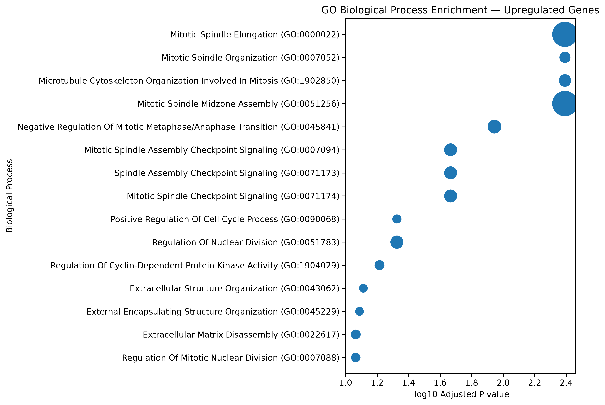
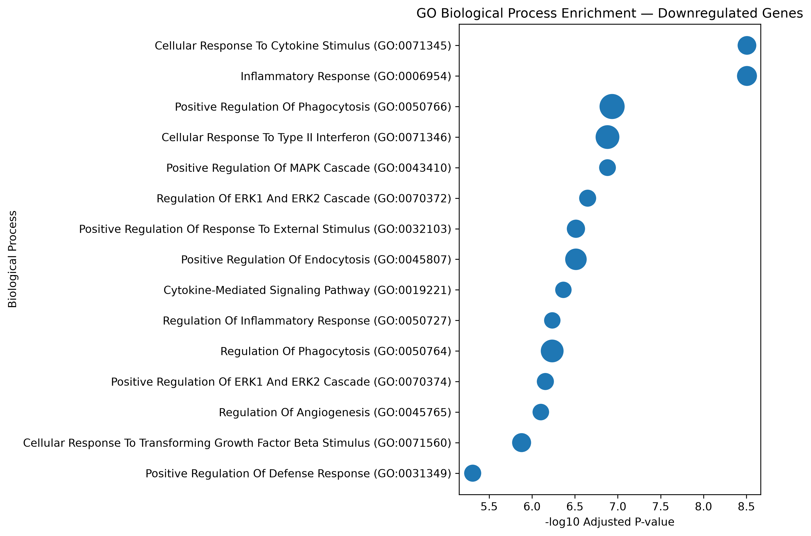
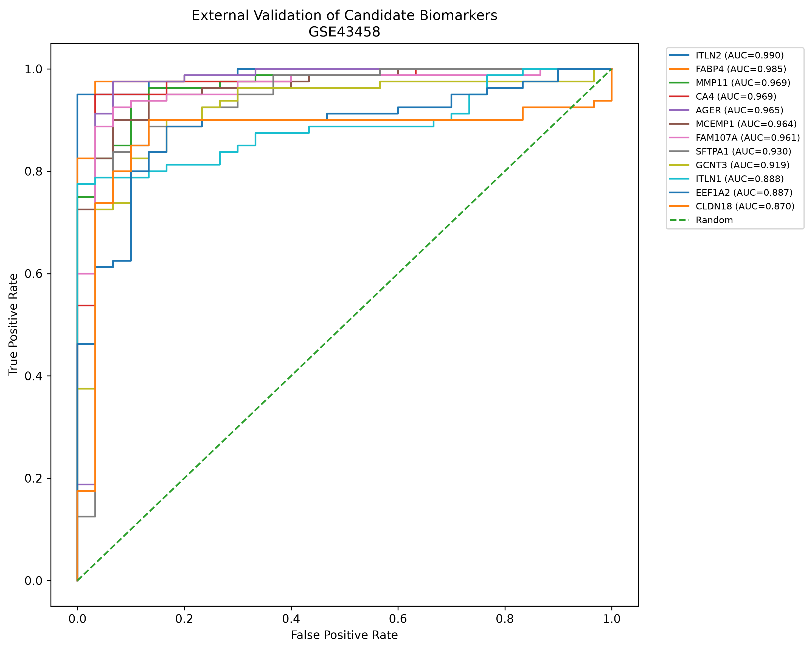
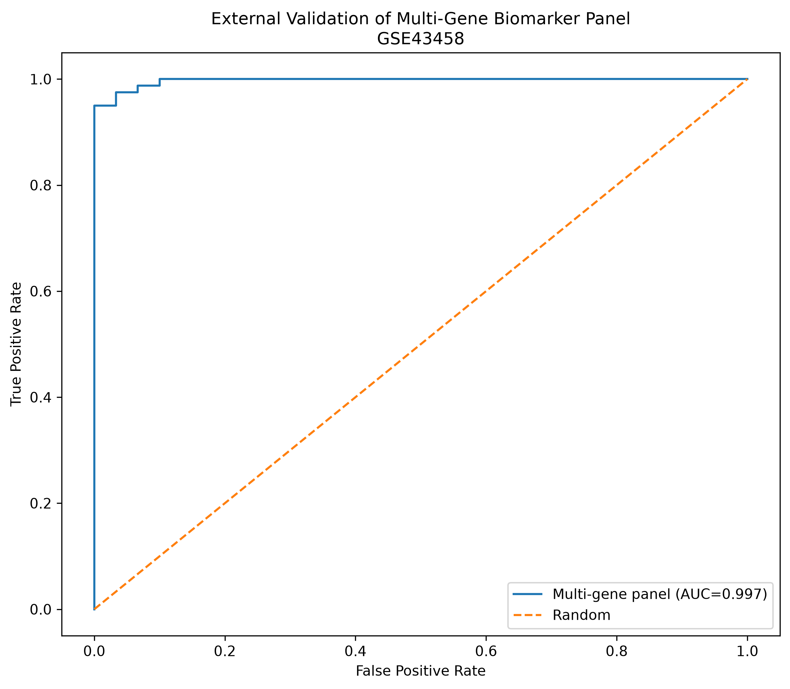
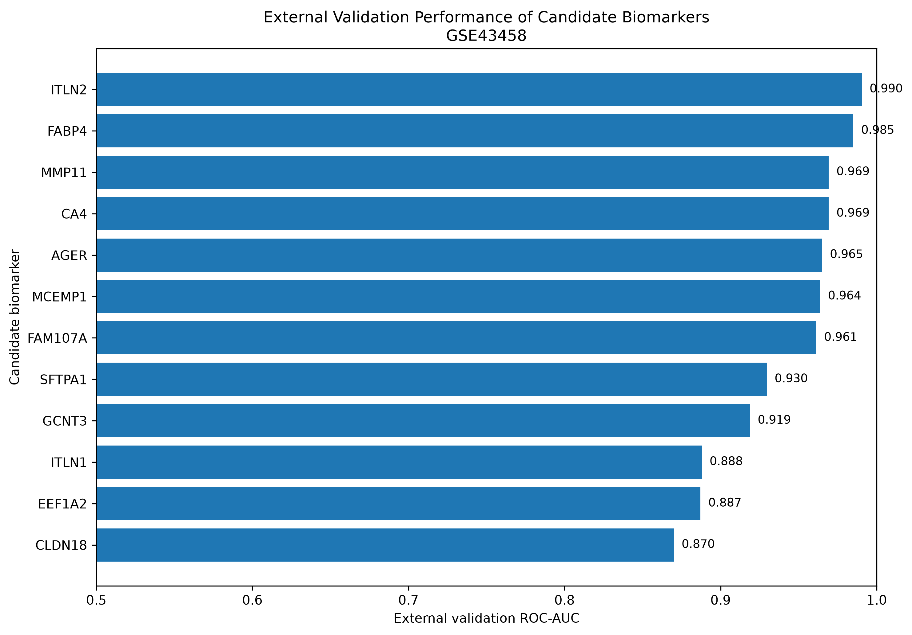
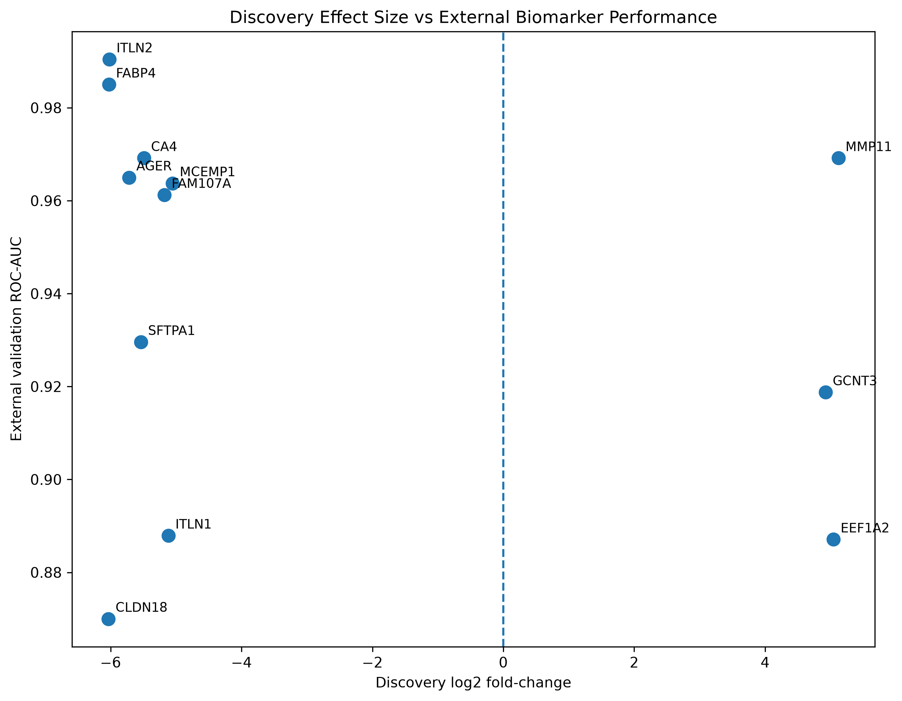
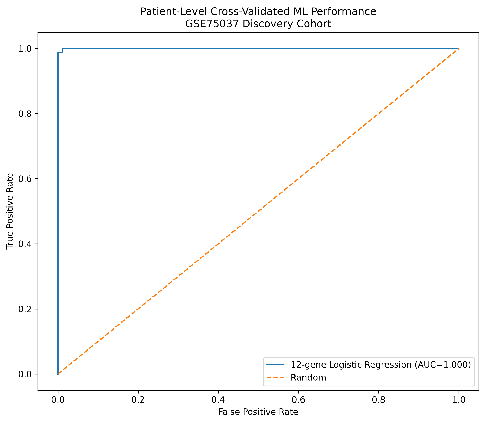
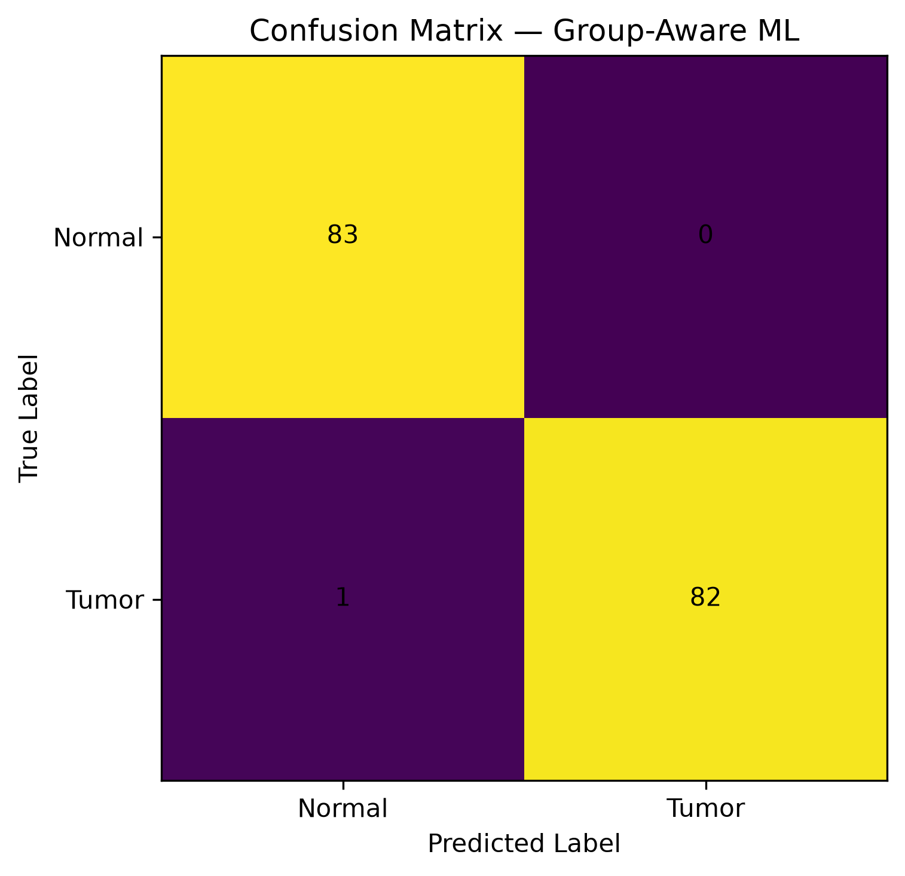

# Cross-Cohort Transcriptomic Biomarker Discovery in Lung Adenocarcinoma

A computational biology project for discovering and externally validating transcriptomic biomarkers associated with lung adenocarcinoma (LUAD), a major subtype of non-small cell lung cancer (NSCLC).

The project integrates paired tumor–normal transcriptomic analysis, differential expression, pathway enrichment, biomarker ranking, ROC/AUC evaluation, external validation, and patient-pair-aware machine learning.

---

## Research Question

Can gene-expression differences between lung adenocarcinoma and matched non-malignant lung tissue be used to identify candidate transcriptomic biomarkers that retain strong discriminatory performance in an independent external cohort?

---

## Project Overview

The project follows a discovery → validation framework:

**GSE75037 Discovery Cohort**

→ Quality Control & Exploratory Analysis

→ PCA

→ Paired Differential Expression

→ Multiple-Testing Correction

→ Candidate Biomarker Selection

→ Pathway Enrichment

→ **GSE43458 External Validation**

→ ROC/AUC Analysis

→ Multi-Gene Biomarker Panel

→ Group-Aware Machine Learning

---

## Datasets

### Discovery Cohort — GSE75037

- 166 total samples
- 83 lung adenocarcinoma tumors
- 83 matched non-malignant adjacent lung tissues
- 83 matched patient pairs
- Platform: Illumina HumanWG-6 v3.0 expression beadchip
- Processed expression values are normalized and log2-transformed

### External Validation Cohort — GSE43458

- 110 total samples
- 80 lung adenocarcinoma tumors
- 30 normal lung tissues
- Platform: Affymetrix Human Gene 1.0 ST Array
- Processed expression values are RMA-normalized and log2-transformed
- Tumor samples include both smoker and never-smoker groups

The validation cohort was selected as an external cohort generated using a different microarray platform, providing a cross-platform validation setting.

---

## Methodology

### 1. Data Acquisition

Transcriptomic datasets were obtained from the NCBI Gene Expression Omnibus (GEO).

The discovery dataset was selected because it contains matched tumor–normal LUAD samples, allowing paired statistical analysis.

---

### 2. Metadata Validation

Before analysis, sample metadata were checked to verify:

- Tumor/normal labels
- Sample identities
- Patient-pair identifiers
- Sample counts
- Expression-metadata alignment

The discovery cohort contained 83 complete tumor–normal pairs.

---

### 3. Quality Control & Exploratory Analysis

Sample-level expression distributions were examined using:

- Mean expression distributions
- Expression boxplots
- Principal Component Analysis (PCA)

PCA showed strong separation between tumor and normal samples, indicating substantial transcriptomic differences between the two biological groups.

---

### 4. Gene-Level Expression Matrix

Probe-level microarray measurements were mapped to gene symbols using the corresponding platform annotation.

Multiple probes mapping to the same gene were resolved using a variance-based selection strategy to obtain a gene-level expression matrix.

---

### 5. Paired Differential Expression

Because GSE75037 contains matched tumor–normal samples, paired differential expression analysis was performed across the 83 patient pairs.

For each gene:

- log2 fold-change was calculated as tumor − normal
- Paired statistical testing was performed
- Benjamini–Hochberg correction was applied to control the false discovery rate

Genes satisfying:

- **FDR < 0.05**
- **|log2FC| ≥ 1**

were considered significantly differentially expressed.

---

### 6. Pathway Enrichment

Significantly upregulated and downregulated genes were analyzed separately using Gene Ontology Biological Process enrichment.

The enrichment analysis was used to interpret the biological processes associated with the transcriptomic changes.

Major enriched processes included:

**Upregulated:**
- Mitotic spindle organization
- Mitotic cell-cycle processes
- Cell division
- Nuclear division

**Downregulated:**
- Inflammatory response
- Cytokine-mediated signaling
- Phagocytosis
- Immune response
- Angiogenesis-related processes

---

### 7. Candidate Biomarker Selection

Candidate biomarkers were selected using the discovery cohort.

Selection incorporated:

- Statistical significance
- Effect size
- Direction of expression change
- Consistency across matched patient pairs

The candidate set was then locked before external validation.

This prevents the validation cohort from being used to select the biomarkers being evaluated.

---

### 8. External Validation

The locked candidate biomarkers were evaluated in GSE43458.

No differential-expression-based candidate selection was performed using the validation cohort.

For each mapped candidate:

- Expression values were evaluated between tumor and normal samples
- ROC curves were generated
- ROC-AUC was calculated
- Discovery direction of expression change was preserved

This provides an external cross-platform validation of the candidate biomarkers.

---

### 9. Multi-Gene Biomarker Panel

A direction-aware multi-gene score was constructed from the candidate biomarkers that successfully mapped to the validation platform.

The panel was evaluated using ROC-AUC in the external cohort.

---

### 10. Machine Learning

Logistic regression was evaluated using 5-fold GroupKFold cross-validation.

Patient-pair identifiers were used as groups so that matched tumor and normal samples from the same patient remained within the same fold.

The model was evaluated using:

- ROC-AUC
- Accuracy
- Sensitivity
- Specificity
- Confusion matrix

This provides a patient-aware assessment of classification performance.

---

# Results Figures

The main generated figures are available in `results/figures/`.

## Pathway Enrichment

### Upregulated Genes

### Downregulated Genes

The enriched biological processes highlight strong cell-cycle and mitotic activity among upregulated genes and immune/inflammatory processes among downregulated genes.

---

## External Validation

### Individual Biomarker ROC Curves

### Multi-Gene Biomarker Panel

The strongest individual candidate, ITLN2, achieved an external validation AUC of 0.9904, while the multi-gene panel achieved an AUC of 0.9971.

---

## Biomarker Performance

### Candidate AUC Comparison

### Discovery Effect Size vs Validation AUC

---

## Machine Learning

### Group-Aware ROC Curve

### Confusion Matrix

---

# Repository Structure

    cancer-biomarker-discovery/
    ├── README.md
    ├── environment.yml
    ├── .gitignore
    │
    ├── data/
    │   ├── raw/
    │   └── processed/
    │
    ├── notebooks/
    │   ├── 01_dataset_reconnaissance.ipynb
    │   └── 02_quality_control_and_eda.ipynb
    │
    ├── src/
    │
    ├── results/
    │   ├── figures/
    │   └── tables/
    │
    └── docs/
        └── dataset.md

Raw and processed datasets are excluded from Git version control because of their size.

---

# Reproducibility

The computational environment is documented in `environment.yml`.

Main tools used:

- Python
- pandas
- NumPy
- SciPy
- Matplotlib
- scikit-learn
- GSEApy
- Jupyter

---

# Key Results

| Analysis | Result |
|---|---:|
| Discovery samples | 166 |
| Matched tumor–normal pairs | 83 |
| Significant DE genes | 3,762 |
| Upregulated genes | 1,807 |
| Downregulated genes | 1,955 |
| External validation samples | 110 |
| Candidates mapped to validation cohort | 12 |
| Best individual biomarker | ITLN2 |
| ITLN2 external validation AUC | 0.9904 |
| Multi-gene panel external validation AUC | 0.9971 |

---

# Results Figures

The main generated figures are available in `results/figures/`.

### Differential Expression

`results/figures/volcano_plot.png`

### Pathway Enrichment

`results/figures/GO_upregulated_dotplot.png`

`results/figures/GO_downregulated_dotplot.png`

### External Validation

`results/figures/external_validation_ROC_curves.png`

`results/figures/external_validation_panel_ROC.png`

### Biomarker Comparison

`results/figures/final_biomarker_AUC_comparison.png`

`results/figures/discovery_effect_vs_validation_AUC.png`

### Machine Learning

`results/figures/ML_group_aware_ROC.png`

`results/figures/ML_confusion_matrix.png`

---

# Limitations

This project represents computational biomarker discovery and external validation rather than clinical diagnostic validation.

Important limitations include:

- The study focuses on LUAD rather than all NSCLC subtypes.
- The datasets are microarray-based rather than RNA-seq.
- Discovery and validation cohorts were generated using different microarray platforms.
- The external validation cohort has differences in smoking-status composition.
- The validation cohort contains 80 tumors and 30 normal samples.
- Cross-platform gene mapping may introduce technical differences.
- Machine-learning evaluation uses a pre-specified biomarker panel selected from the discovery analysis rather than performing feature selection independently inside every cross-validation fold.
- Experimental validation and larger clinical cohorts would be required before clinical translation.

Therefore, ROC-AUC values should be interpreted as **computational cohort-level discrimination**, not as proof of clinical diagnostic utility.

---

# Conclusion

This project demonstrates an end-to-end computational workflow for transcriptomic biomarker discovery in lung adenocarcinoma.

The workflow integrates:

**paired differential expression → biological pathway interpretation → candidate biomarker selection → external cross-platform validation → ROC/AUC analysis → machine-learning evaluation**

The identified candidate biomarkers, particularly **ITLN2**, showed strong discriminatory performance in an external cohort, while the multi-gene panel achieved an external validation ROC-AUC of **0.9971**.

The project provides a reproducible computational framework for identifying and prioritizing transcriptomic biomarkers for further biological investigation.

---

# Author

**Rajat**

B.Tech Biotechnology — Computational Biology

GitHub: `rajat344`
